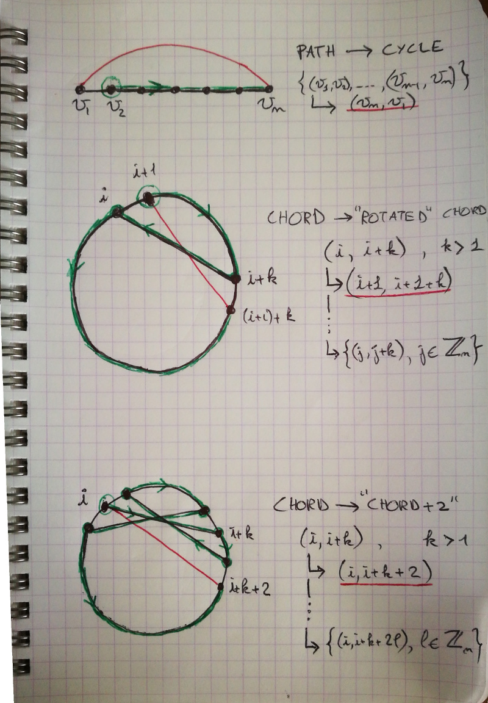
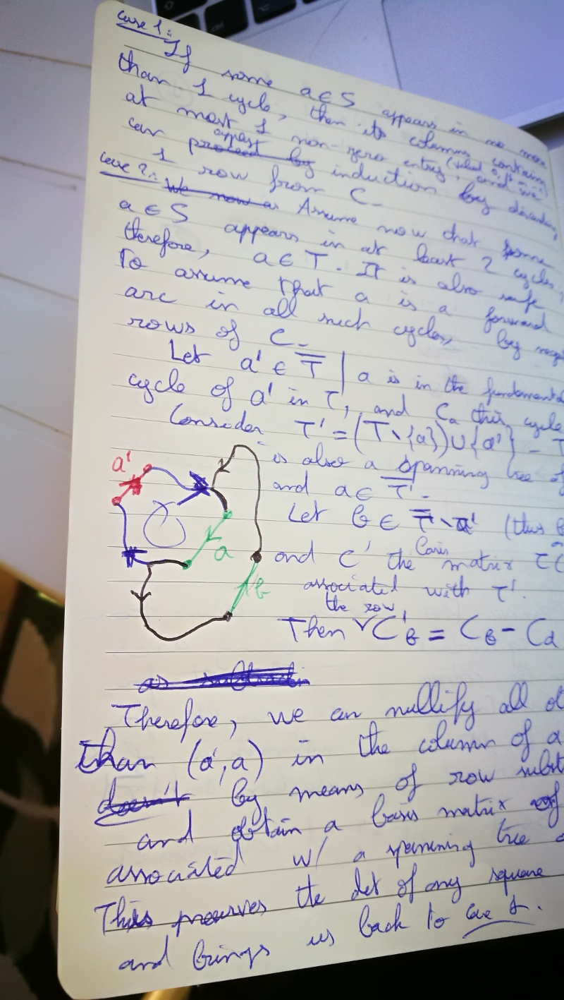

= Exercises solutions and hints

Don't expect to find *all* the answers here :)

== Chapter 6: tree-search algorithms

=== 6.1.10

What does it mean for every DFS-tree to be a Hamilton path? It essentially means that if you walk the graph by always following links to 'unexplored' vertices, wherever you start from and whatever navigation choices you make, you won't reach a 'dead-end' before having exhausted all the vertices of the graph (DFS-trees 'branch' when you are forced to 'back-track' after having reached a dead-end).

The idea of the proof is to use this observation to 'deduce' new edges from previously identified sets of edges:

* **Lemma 1 ('path -> cycle'):** if `G` contains a Hamilton Path `uPv`, then `G` contains the edge `(v, u)`; in other words `P` can be extended to a Hamilton Cycle. We prove it by starting a DFS-tree from the second vertex of the path - see figure.

Therefore `G` contains a Hamilton cycle; we index the vertices of `G` by the `Zn`, the cyclic group of order `n`. Either `G` is a cycle, and there is nothing more to prove, or `G` contains a _chord_, i.e an edge of the form `(i, i+k), k > 1`.

* **Lemma 2 ('chord -> rotated chord'):** if `G` contains a chord `(i, i+k)`, then `G` contains the chord `(i+1, i+1+k)`. If follows that `G` contains all the chords of 'arc-length' `k`: `{(j, j+k), j ∈ Zn}`. We prove it by constructing a Hamilton Path from `i+1` to `i+k+1` (see figure) and applying Lemma 1.

* **Lemma 3 ('chord -> chord + 2'):** if `G` contains a chord `(i, i+k)`, then `G` also contains the chord `(i, i+k+2)`. 

* **Lemma 4 ('2-chord -> 3-chord'):** if `G` contains a chord `(i, i+2)`, then `G` also contains the chord `(i, i+3)`. By Lemma 1, we can prove it by constructing a Hamilton path from `i` to `i+3`: starting from `i`, we follow the 2-chord to `i+2`, then 1 edge counterclockwise to `i+1`, then to `i-1` through a 2-chord (which exists by Lemma 2), then follow the peripheral path to `i+3`. (Not drawn on the figure).

From these lemmata, it is easily seen that if `G` contains a chord, then `G` is either a complete graph, or a complete bipartite graph with evenly sized parts; in particular, the existence of a 2-chord is the decisive factor for the completeness of `G`.

=== 6.2.1

By induction on the number of edges. If `m = n - 1`, then `G` is a tree and there is nothing to prove. Otherwise, let `e` the maximum-weight non-cut-edge of G; then show that `e` is in no optimal tree of G, therefore the optimal trees of `G` are the optimal trees of `H := G \ e`, of which there is only one by induction hypothesis.

== Chapter 13: the Probabilitic Method

=== 13.3.4

The crux of the exercise is in a)ii), which boils down to proving the following analysis result: `(exp(x) + exp(-x))/2 <= exp(x^2 / 2)`.

It looks like high-school math, but it's surprisingly more difficult; you have multiplications inside the exponential and additions outside, which is exactly the opposite of what you want. I've had great fun challenging my scientifically-inclined friends with this problem, it usually drives them crazy in a matter of hours (if that's any consolation to them, it took me half a dozen attempts, spread over 2 days). **Hint** in 3, 2, 1...

Hint: write each side of the result as power series.

=== 13.3.18: the Countable Random Graph

a) There's no trick to the proof; one just has to be careful of justifying the probabilistic manipulations properly, as we're dealing with infinite families of events here. In particular:

* Given X and Y, the infinite family of events "z is either adjacent to some vertex in Y, or not adjacent to some vertex in X" (for z outside of X and Y) are independent and of constant probability; this can be used to prove that the intersection of these events has probability 0.
* The family of pairs of disjoint finite subsets (X,Y) is countable; viewing the negation of property we try to prove as a union of events indexed by (X,Y), one can deduce that the probability of this union is less than the sum of their probabilities (which are all zero).

b) As a technical prerequisite, observe that the property in a) can be refined as follows: the vertex z can always be chosen outside of X and Y (if every vertex in Y has a neighbour in Y, that has to be the case; if not, you can extend Y to make it so). 

Now, given 2 graphs G and H with that property, you could build an induced subgraph of H isomorphic to G with the following procedure:

* choose an enumeration (x0, x1, x2, ...) of V(G)
* map x0 to any vertex of H, calling it y0
* for n > 0, using property a), choose yn such that for m < n, yn is adjacent to ym iff xn is adjacent to xm.

Of course, that's not quite what we want, since we only have produced an isomorphism to an induced subgraph of H, not to H itself. By the way, this shows that a graph with property a) contains _every_ countable graph as an induced subgraph, which is rather interesting in itself. 

The above procedure only needs a small alteration to actually yield an isomorphism between G and H. Essentially, instead of always choosing the next 'source' vertex from G and finding a 'mirror' vertex in H, you pick the 'source' vertex alternatively from G and H; this ensures that all vertices of G and H are covered by the procedure.

== Chapter 16: Matchings

=== 16.1.15

I'm currently at a loss for this one. I've seen online solutions using the König-Egervary Theorem, but the exercise is actually intended as a Lemma for this theorem.

The result is easily deduced from Lemma 16.10 2 sections later, so maybe the proof of 16.10 could be adapted for this special case.

=== 16.2.7

Not that easy IMHO!

a) I prove that any edge `e`, joining `x` to `y`, us covered. Nothing to prove if `x` is not in `Z`. If `x` is in `Z`, consider an M-alternating path starting from U ending in x; prove it either contains y or can be extended to end in y, as in the latter case x would not be matched to y.

b) 2 observations here:

* all vertices in X \ R are matched (as U is contained in R)
* a vertex in X \ R is never matched to a vertex in B

Counting the matched vertices in Y, it then follows that |M*| is greater than or equal to |X\Z| + |B|, which is exactly |K*|.

=== 16.2.8

Not easy either IMHO. There's an error in the problem statement: it's actually |S| - |N(S)| in a).

The hard part of the exercise is the 'if' part of a)ii): let M a maximum matching, and S the set of vertices in X reachable from U by M-alternating paths. Note that S contains U.

Use Berge's theorem to prove that all neighbours of S are matched to a vertex of S (I decomposed S into matched and unmatched vertices, then you get `|N(S)| = |N(S\U)| = |S\U| = |S| - |U|`). 

=== 16.2.11

I answered that one https://math.stackexchange.com/a/3231948/141752[here].

=== 16.2.18

You prove that there's a permutation matrix which support is contained in the support of Q, then use induction.

To get the first result, you model this with a bipartite graph which vertices are the lines of Q (rows on the left, columns on the right), and the edges are the non-zero entries of Q, each incident to the row and line containing it. Hall's condition can be deduced by considering row sums and column sums.

=== 16.2.20

You model this problem by a bipartite graph where the vertices are the left cosets on one side and the right cosets on the other. The edges are the elements of H, each joining to left and right cosets to which it belongs. The problem reduces then to proving that there's a perfect matching in this graph.

It's worth noting that the left cosets are the equivalence classes by the equivalence relation of being 'right-proportional', i.e `x = y.k` where `k` is in K. Likewise for right cosets, except it's not the same equivalence relation. 

Therefore each coset has `|K|` elements, i.e all vertices of G have degree |K|; the Hall condition can be deduced from that.

=== 16.2.27

No difficulty in a), it's the same as for finite graphs.

My counterexample is a graph which vertices are the natural integers, each `n` joined to `n+1`, plus an additional vertex `x` joined to all odd integers. Assuming a perfect matching, and considering the odd integer matched to `x`, it follows that `0` can't be matched.

Now I wondered if I cheated by using a vertex of infinite degree. AFAICT, it turns out that if you forbid infinite degrees, then there is no counter example. I view this as a consequence of the https://en.wikipedia.org/wiki/Compactness_theorem[Compactness Theorem] of boolean logic: each edge is a boolean variable, and a matching is an assignment of truth that satisfies a set of boolean formulas. I find this rather neat actually: Hall's theorem gives you full matchings for finite subgraphs, then the compactness theorem generalizes to the whole graph.

=== 16.3.8

**ERRATUM:** the final result is not quite correct; it should be "a **connected** graph is hypomatchable iff the empty set is its only barrier", or the more general "the **components of a graph** are hypomatchable iff the empty set is its only barrier."

a) 

i) The problem statement should be "a **connected** graph is hypomatchable iff each of its blocks is hypomatchable". Both direction of the equivalence can be proved by induction on the number of blocks. Considering a separating vertex `s` separating G into two subgraphs `H` and `H'`, and a vertex `v` of H, consider how to construct a perfect matching of `G-v` can be built from / decomposed into perfect matchings of `H-v` and `H'-s`.

   ii) The 'only if' part is easily proved by applying (16.2). For the 'if' part, you first deduce from Tutte-Berge that the empty set is the only barrier of G (it's the only one that might achieve equality in (16.3)). You can then first prove the result for a non-separable graph, applying the inequality for `S = {v}` to deduce that `G-v` is matchable by Tutte-Berge. You can then prove that the hypothesis inequality applies to each block of G; to do that, it helps to picture the blocks-decomposition-tree of G, and observe that the all blocks of G are odd; you can then prove that the components of `G-S` can be obtained from the components of `H-s` by either adding separate components or extending components of `H-S` with an even number of vertices, and so `H-S` has no more odd components than `G-S`. Finally you apply a)i).

b) The 'if' part is the hard one. For a vertex `v`, and a proper subset `S` of `V`, observe the equivalence `(G-v)-S = G-(S∪{v})`; use the fact that `S∪{v}` is not a barrier of G to show that `G-v` is matchable with the Tutte-Berge formula, making a case analysis between G even (`o(G) = 0`) and odd (`o(G) = 1`).

== Chapter 20: Electrical Networks

=== 20.4.3

Detailing for the Circulation Space, the Tension Space is analogous.

We prove the result by induction on the dimension of the Circulation Space, i.e the size of a cotree. Observe that selecting rows from `C` is equivalent to removing arcs from the cotree, so it's sufficient to consider only full-height square submatrices of C and prove they have a determinant in `{-1, 0, 1}`. We therefore consider a set `S` of `dim(C)` columns/arcs of `C`.

Given an arc `a` in `S`, we then make the following case distinction:

**case 1:** if `a` appears in no more than 1 fundamental cycle, then its column contains at most 1 non-zero entry, and we can compute the determinant applying induction.

**case 2:** if `a` appears in several fundamental cycles, then `a` is in the tree `T`. We can pick a fundamental cycle containing `a`, corresponding to a non-zero entry in the column of `a`, and then add or substract it to other rows of `C` so as to nullify the other entries in the column of `a` without changing the determinant. It can be shown (A) that this yields the basis matrix associated with another tree `T'` of `G`, namely one consisting of removing `a` from `T` and adding back the cotree arc corresponding to the row we picked. This brings us back to case 1. To prove (A), you can consider how the `T'`-path joining the ends of cotree arc relates to the corresponding `T`-path: it consists of going 'the other way around' the fundamental cycle we initially picked.

=== 20.5.2

The result is `r_xy = (n -1) / m`. The main ideas of the proof are:

1. Given 2 edges `e1` and `e2` of G, exactly 1 out of `m` automorphisms of G sends `e1` to `e2`, as `G` is edge-transitive.
2. To each spanning tree `T'` of `G/e` and each automorphism of `G`, there corresponds exactly one spanning tree `T(e')` of `G` with a marked edge `e'` along with an automorphism sending `e'` to `e`.
3. The 'spanning trees ratio formula' of Corollary 20.23 lets you then work out `r_xy` from 2.
